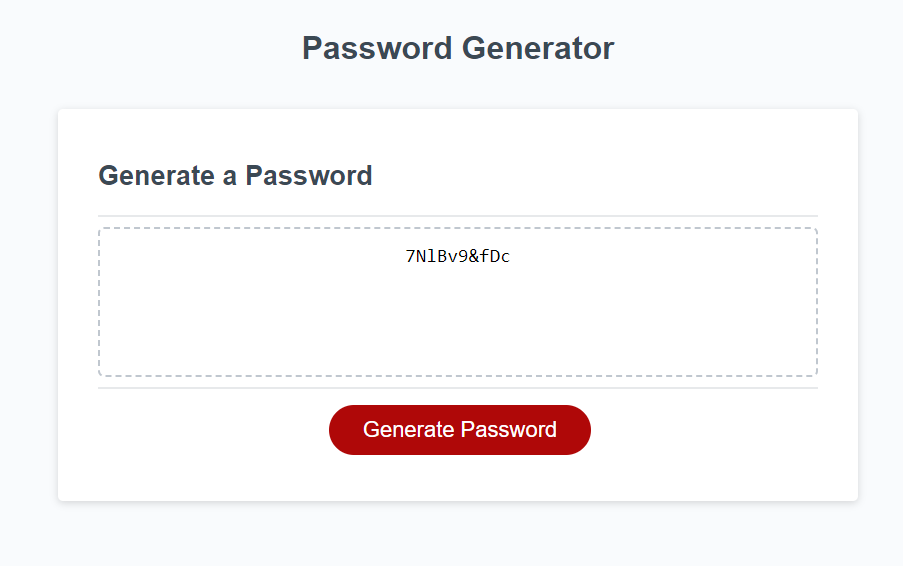

Welcome to my password generator! This is a secure way to generate random passwords within a given acceptance criteria.

****PLEASE SEE BELOW FOR HOW IT WORKS****

GIVEN you need a new, secure password. WHEN you click the button to generate a password, THEN you are presented with a series of prompts for password criteria.

WHEN prompted for password criteria, THEN you select which criteria to include in the password.

WHEN prompted for the length of the password, THEN you choose a length of at least 8 characters and no more than 128 characters.

WHEN asked for character types to include in the password, THEN you confirm whether or not to include lowercase, uppercase, numeric, and/or special characters.

WHEN you answer each prompt, THEN your input will be validated and at least one character type would be selected.

WHEN all prompts are answered, THEN a password is generated that matches the selected criteria.

WHEN the password is generated, THEN the password is either displayed by being written to the page.

A link to the the website can be found here: https://waltscode.github.io/Challenge3_java/ 

Screenshot of the website can be found below:

 